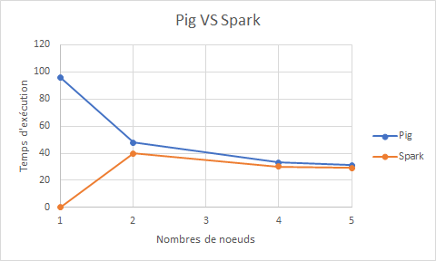

# PageRankProject
# Contributeurs

- Jebahi Haïkel 
- Malezy Vincent

# Performances sur pagerank implantation Pig 

Les données ont été récupérés sur : gs:///public_lddm_data/
Nous nous sommes aidés des codes disponibles sur le dépôt : https://github.com/momo54/large_scale_data_management

| Nombre de noeuds  | Durée écoulée           | 
|-------------------|-------------------------|
| 1 noeuds          | 1 h 39 min              |
| 2 noeuds          | 48 min 25 s             |
| 4 noeuds          | 33 min 47 s             |
| 5 noeuds          | 31 min 28 s             |

# Performances sur pagerank implantation Spark

| Nombre de noeuds  | Durée écoulée           | 
|-------------------|-------------------------|
| 2 noeuds          | 40 min 57 s             |
| 4 noeuds          | 30 min 34 s             |
| 5 noeuds          | 29 min 20 s             |

# Résultat Pig x Spark
Afin de comparer tous nos résultats, nous les avons rassemblés dans un diagramme : 
 

# Meilleur page ranks

* http://dbpedia.org/resource/Living_people,  36794.331467544755

